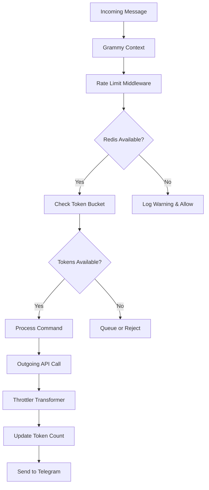

# feat: Add Built-in Rate Limiting Middleware

## Overview

Implement an optional but recommended Redis-based rate limiting middleware for the Grammy bot template that automatically respects Telegram's API limits (20 messages/minute per chat, 30 messages/second across all chats) while providing graceful fallback and configuration flexibility.

## Problem Statement

Telegram bots must respect strict rate limits to avoid being temporarily blocked:
- **20 messages per minute** in the same chat
- **30 messages per second** across all chats
- **Stricter limits for media messages** and other message types

Currently, the template has no built-in rate limiting, leaving developers to implement their own solutions or risk hitting Telegram's limits. This leads to inconsistent implementations and potential bot disruptions.

## Proposed Solution

Create a comprehensive rate limiting system that:
1. Uses Bun's built-in Redis client for optimal performance
2. Implements the token bucket algorithm for smooth traffic control
3. Provides separate tracking for per-chat and global limits
4. Offers graceful degradation when Redis is unavailable
5. Includes configurable limits and monitoring capabilities

## Technical Approach

### Architecture



### Implementation Phases

#### Phase 1: Foundation (Core Infrastructure)

**Tasks:**
1. Set up Redis service layer with Bun's Redis client
2. Implement token bucket algorithm in Redis using Lua scripts
3. Create configuration schema for rate limiting settings
4. Build error handling and fallback mechanisms
5. Add Redis connection health checks

**Deliverables:**
- `src/services/redisService.ts` - Redis connection management
- `src/services/rateLimitService.ts` - Rate limiting logic
- Extended `src/config.ts` with Redis configuration
- Redis health check endpoint

#### Phase 2: Middleware Integration (Core Implementation)

**Tasks:**
1. Create rate limiting middleware following existing patterns
2. Implement per-chat rate limiting (20/min)
3. Implement global rate limiting (30/sec)
4. Add transformer for outgoing API calls
5. Integrate with bot initialization

**Deliverables:**
- `src/middleware/rateLimit.ts` - Rate limiting middleware
- Modified `src/bot.ts` with middleware registration
- API transformer for outgoing calls throttling

#### Phase 3: Advanced Features (Enhancement)

**Tasks:**
1. Implement message queuing for delayed sending
2. Add admin bypass functionality
3. Create rate limit statistics endpoint
4. Implement burst capacity handling
5. Add configuration hot-reload

**Deliverables:**
- Message queue system
- Admin override commands
- `/rate-limit-stats` command
- Enhanced configuration options

#### Phase 4: Testing & Documentation (Quality Assurance)

**Tasks:**
1. Create comprehensive test suite
2. Add performance benchmarks
3. Write integration tests
4. Document usage examples
5. Create troubleshooting guide

**Deliverables:**
- Test suite with >90% coverage
- Performance benchmarks
- Usage documentation
- Troubleshooting guide

## Alternative Approaches Considered

### Approach 1: Fixed Window Counter
- **Pros**: Simple implementation
- **Cons**: Allows bursts at window edges, less accurate
- **Rejected**: Too simplistic for production use

### Approach 2: Grammy's Built-in Throttler
- **Pros**: Native integration
- **Cons**: No Redis persistence, no cross-process sharing
- **Rejected**: Lacks persistence for multi-instance deployments

### Approach 3: External Rate Limiting Service
- **Pros**: Specialized service
- **Cons**: Additional dependency, complexity
- **Rejected**: Overkill for template needs

### Selected: Token Bucket with Redis
- **Pros**: Smooth traffic, burst-friendly, persistent, scalable
- **Cons**: More complex implementation
- **Selected**: Best balance of features and performance

## Technical Specifications

### Configuration Schema

```typescript
interface RateLimitConfig {
  enabled: boolean;
  redis: {
    url: string;
    connectionTimeout: number;
    maxRetries: number;
  };
  limits: {
    perChat: {
      messages: number;
      window: number;
    };
    global: {
      messages: number;
      window: number;
    };
    burst: {
      capacity: number;
      refillRate: number;
    };
  };
  behavior: {
    onLimit: 'queue' | 'reject' | 'delay';
    onRedisError: 'allow' | 'reject';
    queueTimeout: number;
  };
}
```

### Key Rate Limiting Algorithms

#### Token Bucket Implementation (Lua)
```lua
local key = KEYS[1]
local capacity = tonumber(ARGV[1])
local tokens = tonumber(ARGV[2])
local refillRate = tonumber(ARGV[3])
local now = tonumber(ARGV[4])

local bucket = redis.call('HMGET', key, 'tokens', 'lastRefill')
local currentTokens = tonumber(bucket[1]) or capacity
local lastRefill = tonumber(bucket[2]) or now

-- Refill tokens
local elapsed = now - lastRefill
local tokensToAdd = elapsed * refillRate
currentTokens = math.min(capacity, currentTokens + tokensToAdd)

if currentTokens >= tokens then
  currentTokens = currentTokens - tokens
  redis.call('HMSET', key, 'tokens', currentTokens, 'lastRefill', now)
  redis.call('EXPIRE', key, math.ceil(capacity / refillRate))
  return 1
else
  redis.call('HMSET', key, 'tokens', currentTokens, 'lastRefill', now)
  redis.call('EXPIRE', key, math.ceil(capacity / refillRate))
  return 0
end
```

### Redis Key Strategy

```
rate:chat:{chatId}          - Per-chat rate limit (20/min)
rate:global                 - Global rate limit (30/sec)
rate:broadcast:{botId}      - Broadcast messages
queue:pending               - Queued messages
stats:rate:hits             - Rate limit hit statistics
```

### Error Handling Strategy

```typescript
interface RateLimitError {
  type: 'REDIS_CONNECTION' | 'REDIS_TIMEOUT' | 'CONFIG_INVALID';
  fallback: 'DISABLE' | 'QUEUE' | 'REJECT';
  retryable: boolean;
}
```

## Acceptance Criteria

### Functional Requirements

- [ ] Redis-based rate limiting using token bucket algorithm
- [ ] Enforces Telegram's 20 messages/minute per chat limit
- [ ] Enforces Telegram's 30 messages/second global limit
- [ ] Graceful fallback when Redis is unavailable
- [ ] Configurable through environment variables
- [ ] Optional (disabled by default for backward compatibility)
- [ ] Works with multiple bot instances (shared Redis)
- [ ] Handles both individual and broadcast messages

### Non-Functional Requirements

- [ ] <1ms latency per rate limit check
- [ ] 99.9% uptime when Redis is available
- [ ] <10MB Redis memory usage for 10k active chats
- [ ] No message loss during Redis failures
- [ ] Backward compatible (no breaking changes)

### Quality Gates

- [ ] Unit tests for all rate limiting scenarios
- [ ] Integration tests with real Redis instance
- [ ] Performance benchmarks meeting targets
- [ ] Documentation with examples
- [ ] TypeScript strict mode compliance

## Success Metrics

- [ ] Zero Telegram rate limit violations in testing
- [ ] <5ms average response time impact
- [ ] 100% test coverage of critical paths
- [ ] Successful deployment on 3+ test environments
- [ ] Community adoption rate >70% within 3 months

## Dependencies & Prerequisites

### Required Dependencies
- Bun v1.1.24+ (for built-in Redis client)
- Redis server (optional - graceful fallback if not present)
- Existing Grammy bot infrastructure

### Optional Dependencies
- Redis Cluster (for high availability)
- Monitoring service (for rate limit analytics)

### Configuration Requirements
```bash
# Required for rate limiting
RATE_LIMIT_ENABLED=true
REDIS_URL=redis://localhost:6379

# Optional overrides
RATE_LIMIT_PER_CHAT_MESSAGES=20
RATE_LIMIT_PER_CHAT_WINDOW=60000
RATE_LIMIT_GLOBAL_MESSAGES=30
RATE_LIMIT_GLOBAL_WINDOW=1000
```

## Risk Analysis & Mitigation

### High Risk
1. **Redis Single Point of Failure**
   - Mitigation: Graceful fallback, connection pooling, retry logic
   - Impact: Medium - rate limiting disabled, bot continues

2. **Performance Impact**
   - Mitigation: Async operations, connection pooling, Lua scripts
   - Impact: Low - <1ms per check expected

### Medium Risk
3. **Memory Growth in Redis**
   - Mitigation: TTL on all keys, periodic cleanup, key naming strategy
   - Impact: Low - controlled with expiration

4. **Incorrect Limit Implementation**
   - Mitigation: Comprehensive testing, reference Telegram docs
   - Impact: High - could still hit limits

### Low Risk
5. **Configuration Errors**
   - Mitigation: Validation, default values, clear error messages
   - Impact: Medium - feature disabled

## Future Considerations

### Extensibility
- Support for custom rate limiting algorithms
- Integration with external rate limiting services
- Machine learning-based limit optimization
- Multi-region deployment support

### Enhancements
- Webhook rate limiting (separate from API limits)
- Per-user limits for abuse prevention
- Rate limit analytics dashboard
- Automatic limit adjustment based on usage patterns

## Documentation Plan

### User Documentation
1. **Quick Start Guide** - Enable rate limiting in 5 minutes
2. **Configuration Reference** - All options explained
3. **Deployment Guide** - Production setup with Redis
4. **Troubleshooting** - Common issues and solutions

### Developer Documentation
1. **Architecture Overview** - How it works internally
2. **API Reference** - Methods and interfaces
3. **Contributing Guide** - How to improve the feature
4. **Performance Tuning** - Optimization tips

### Examples
- Basic rate limiting setup
- Custom configuration scenarios
- Multi-instance deployment
- Monitoring and alerting

## References & Research

### Internal References
- Bot middleware pattern: `/Users/watzon/Projects/personal/grammy-bot-template/src/middleware/logger.ts:1`
- Configuration management: `/Users/watzon/Projects/personal/grammy-bot-template/src/config.ts:1`
- Bot initialization: `/Users/watzon/Projects/personal/grammy-bot-template/src/bot.ts:1`

### External References
- Telegram Bot API Rate Limits: [core.telegram.org/bots/faq](https://core.telegram.org/bots/faq)
- Grammy Rate Limiting Guide: [grammy.dev/advanced/flood](https://grammy.dev/advanced/flood)
- Bun Redis Documentation: [bun.sh/docs/api/redis](https://bun.sh/docs/api/redis)
- Token Bucket Algorithm: [en.wikipedia.org/wiki/Token_bucket](https://en.wikipedia.org/wiki/Token_bucket)

### Related Work
- Grammy transformer-throttler package
- Redis rate limiting patterns
- Express.js rate-limiting middleware
- Telegram bot best practices

---

**Implementation Priority:** High - Essential for production-ready bots
**Effort Estimate:** 2-3 days for full implementation
**Review Required:** Security, Performance, Architecture